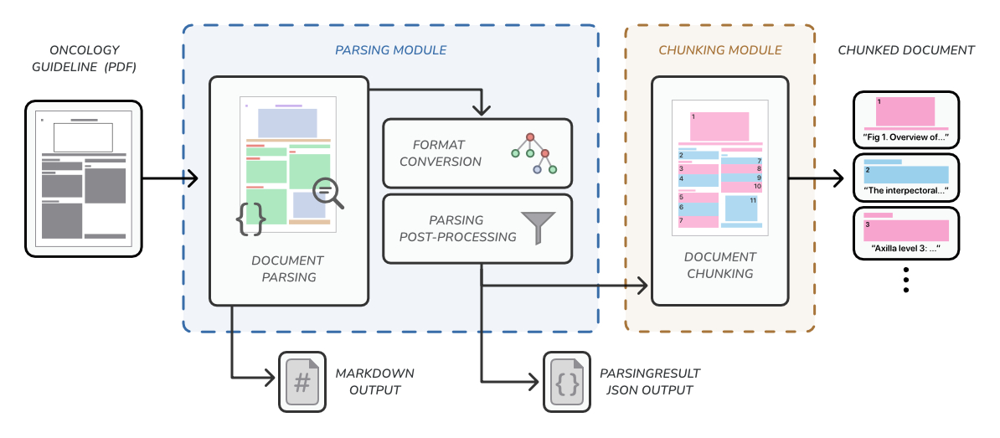

<h1 align="center">Evaluating and Enhancing Location-Aware Visual Document Segmentation for Oncology Guidelines</h1>

This repository contains the source code for the experiments conducted as a part of my bachelor's
thesis in Information Systems. A part of this research was the introduction of a modular document
segmentation pipeline that allows for the parsing and chunking of PDF documents (specifically
oncology guidelines) using eight different document parsing implementations and four chunking
strategies.

<div align="center">
  
</div>

In this thesis, we propose a novel chunking methodology that enables visual source attribution on
the
token-level. For more information, the LaTeX files and compiled PDF document of my thesis can be
found in the `thesis` directory.

We provide both a Python library and a command line interface for creating and interacting
with the document segmentation pipeline.

## Setup

This project uses `uv` for dependency management.
After installing `uv`, the virtual environment is activated with the following commands:

```bash
source .venv/bin/activate
uv sync
```

## Data locations

All paths are relative to the project root (see `config.py`). All input and output files are
contained in the `data` directory. Inside this directory, there are multiple subdirectories:

| Directory          | Description                    |
|--------------------|--------------------------------|
| `configs/`         | Benchmark configuration files  |
| `guidelines/`      | Input PDF documents            |
| `images/`          | Images extracted by the parser |
| `markdown/`        | Document content as Markdown   |
| `parsing-result/`  | ParsingResult as JSON          |
| `chunking-result/` | ChunkingResult as JSON         |
| `annotated/`       | Annotated PDF documents        |

## CLI usage

The pipeline is invoked through `lib.pipeline`.

```bash
python -m lib.pipeline <input> [flags] <parser> [chunker] [chunker_options]
```

Only `input` and `parser` are strictly required to use this CLI.
If no `chunker` is specified, the pipeline will complete after the parsing module.

#### Input

All input documents need to be stored under `data/guidelines`. This directory needs to be manually
created when opening the project for the first time. The pipeline allows for both single-file
and batch processing.

- `-f, --file`: Filename of a singular PDF document without extension
- `-b, --batch`: Directory name for batch processing

#### Flags

- `-E, --exist_ok`: Skip document parsing if the output JSON already exists
- `-D, --draw`: Create annotated PDF documents for the document parsing and chunking output

### Usage Examples

```bash
# Parse a single file with Docling without chunking
python -m lib.pipeline -f example_guideline docling

# Parse a single file with Docling and
# Chunk using Fixed-size chunking at a maximum chunk size of 128
python -m lib.pipeline -f example_guideline docling fixed_size -N 128

# Batch parsing with MinerU Pipeline and save annotated documents
python -m lib.pipeline -b my_dir -D mineru_pipeline
```

See `python -m lib.pipeline <parser> <chunker> --help` for more details.

### Pipeline Outputs

For the outputs of the **parsing module**, the output paths follow the following schema:

> `#/<parser>/[batch]/<file>.*`

Hereby, `#` denotes the type of output (e.g., `markdown`, `annotated`, `parsing-result`) and `*`
denotes the file type.
For `images`, a directory is created for each file where extracted images are stored.

For the outputs of the **chunking module**, the output paths follow this schema:

> `#/<chunker>/<max_tokens>_<parameter>/<parser>/[batch]/<file>.*`

Hereby, `<parameter>` refers to the tunable parameter of the chosen chunking strategy.

## Supported Document Parsing Implementations

| Parser                   | Value             |
|--------------------------|-------------------|
| LlamaParse               | `llamaparse`      |
| Unstructured.io          | `unstructured_io` |
| Docling                  | `docling`         |
| Granite Docling          | `docling_granite` |
| MinerU 2.5 Pipeline      | `mineru_pipeline` |
| MinerU 2.5 VLM           | `mineru_vlm`      |
| Gemini 2.5 Flash         | `gemini`          |
| Document AI LayoutParser | `document_ai`     |

## Supported Chunking Strategies

| Chunker      | Value          | Params\*                             |
|--------------|----------------|--------------------------------------|
| Fixed-size   | `fixed_size`   | `-O, --overlap`                      |
| Recursive    | `recursive`    | `-O, --overlap`                      |
| Semantic     | `semantic`     | `-M, --min_tokens; -Q, --percentile` |
| Hierarchical | `hierarchical` | `-Bh, --budget`                      |

\*) `-N, --max_tokens` is available for all chunking strategies.

## Library Usage

Instead of relying on the CLI, each implementation and strategy can also be invoked as class
instances.
For more information, refer to the `DocumentParser` and `DocumentChunker` classes.

### Example Usage

```python
file_path = GUIDELINES_DIR / "example_guideline.pdf"

options = {
    ParserOptions.EXIST_OK: True,
    ParserOptions.DRAW: True
}

parser = DoclingParser(use_vlm=False)
parsing_result = parser.process_document(file_path, options=options)

chunker = RecursiveChunker(max_tokens=128, overlap=32)
chunking_result = chunker.process_document(parsing_result, draw=True)
```
